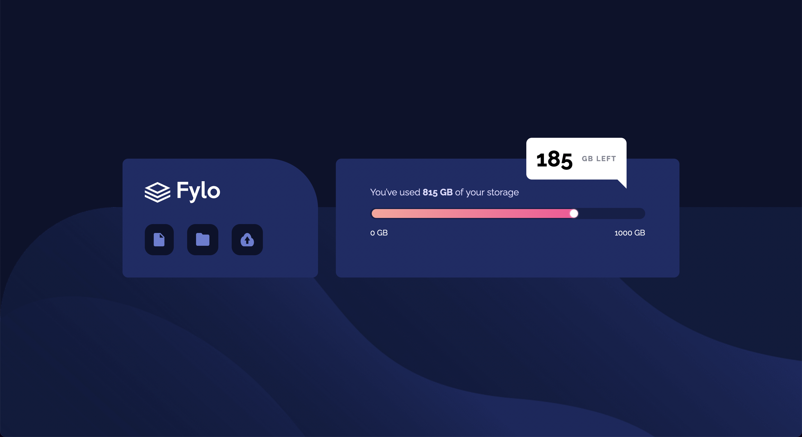

# Frontend Mentor - Fylo data storage component solution

This is a solution to the [Fylo data storage component challenge](https://www.frontendmentor.io/challenges/fylo-data-storage-component-1dZPRbV5n) on Frontend Mentor

## Table of contents

-  [Overview](#overview)
   -  [The challenge](#the-challenge)
   -  [Screenshot](#screenshot)
   -  [Links](#links)
-  [My process](#my-process)
   -  [Built with](#built-with)
   -  [What I learned](#what-i-learned)
   -  [Continued development](#continued-development)
   -  [Useful resources](#useful-resources)
-  [Author](#author)

## Overview

### The challenge

Your users should be able to:

-  View the optimal layout for the site depending on their device's screen size

### Screenshot



### Links

-  Live Site URL:

## My process

### Built with

-  Semantic HTML5 markup
-  Flexbox
-  Mobile-first workflow

### What I learned

```css
:root {
   background: hsl(229, 57%, 11%) url('/images/bg-desktop.png') no-repeat bottom /
      100% 52.5%;
}
```

The background SVG for this project was at first difficult to control since naturally it would continue to scale as the viewport increased. While experimenting with the size of the asset, I discovered that providing a fixed height with a fluid width allowed the SVG to only scale along the x axis. In this instance it works quite nicely, but I am aware not all assets will look pleasant if they're continually stretched in this manner.

```css
.logo-container__icons-container {
   display: flex;
   flex-wrap: wrap;
}
```

I decided to experiment with the icons' container by making it a flex container, so when I added additional icons into the markup the layout would dynamically respond. This contrasted to my previous approach where I aligned the icons via the `vertical-align` property, a style which would need to be replicated for each new icon added.

```css
.data-container__meter::after {
   height: 14px;
   width: 14px;
   right: 24.5%;
   bottom: 3px;
   box-shadow: 0 0 3px 0 white;
}
```

The fluid and responsive positioning of the progress bar and circular pseudo element within also became a challenging feature of this project. I had to provide a fluid percentage-based horizontal position so the circle would respond with its parent bar and not become mis-aligned, whilst applying a fixed size and box-shadow to achieve the same glow effect.

### Continued development

I would like to continue using the `clip-path` property in future projects for different purposes, although I do realise those may be quite specific and niche.

Finally, I look forward to even more practice with controlling background images and the way they respond to different viewports. This technique seems easy to learn at first, yet still provides new challenges and bugs each project I use it.

### Useful resources

-  [Using CSS Clip Paths](https://teamtreehouse.com/library/css-clipping-paths) - This tutorial taught me all the basics about using clip paths, alongside some practical examples such as creating an effect where text can blend in with background images, via 'clipping' certain shapes to hide the text at specific points.

## Author

-  Website - [Joshua Jameson-Wallis](https://joshuajamesonwallis.com)
-  Linkedin - [Joshua Jameson-Wallis](https://www.linkedin.com/in/joshua-jameson-wallis/)
